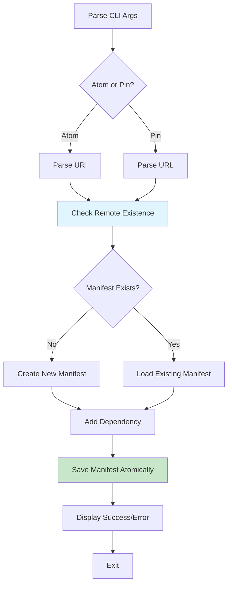

# Architectural Decision Record (ADR): Eka Add Command Architecture

## Status

Proposed

## Context

The `eka add` command needs to add dependencies to an Atom's manifest while ensuring the dependency exists remotely. This requires checking remote resources efficiently without downloading content, supporting both Atom URIs and legacy pin URLs, and updating the manifest TOML file. The command should integrate cleanly with the existing atom crate for reusability and follow established patterns for error handling and user experience.

## Decision

### 1. Core Library Functions in Atom Crate

**Remote Existence Checking** (new module: `crates/atom/src/remote.rs`):

```rust
pub async fn check_atom_exists(
    url: &Url,
    atom_id: &Id,
    version: Option<&VersionReq>
) -> Result<bool, RemoteError>

pub async fn check_pin_exists(
    url: &Url,
    refspec: Option<&str>
) -> Result<bool, RemoteError>
```

**Manifest Update Utilities** (extend `crates/atom/src/manifest.rs`):

```rust
impl Manifest {
    pub fn add_atom_dependency(
        &mut self,
        uri: &Uri
    ) -> Result<(), ManifestError>

    pub fn add_pin_dependency(
        &mut self,
        url: &AliasedUrl,
        refspec: Option<&str>
    ) -> Result<(), ManifestError>
}
```

**File I/O Utilities** (new module: `crates/atom/src/manifest/io.rs`):

```rust
pub struct ManifestManager {
    pub fn load(path: &Path) -> Result<Manifest, ManifestError>
    pub fn save_atomic(manifest: &Manifest, path: &Path) -> Result<(), ManifestError>
}
```

### 2. CLI Integration Design

**Command Structure** (`src/cli/commands/add/mod.rs`):

```rust
#[derive(Parser)]
pub struct Args {
    /// The atom URI or pin URL to add as a dependency
    dependency: String,
    /// The path to the atom to modify (defaults to current directory)
    #[arg(short, long, default_value = ".")]
    path: PathBuf,
    /// Git refspec for pin dependencies (branch, tag, or commit)
    #[arg(long)]
    r#ref: Option<String>,
    /// Target remote for local atom refs
    #[arg(long, short = 't')]
    remote: Option<String>,
}
```

**Execution Flow**:

1. Parse dependency string into `Uri` or `AliasedUrl`
2. Load existing manifest from `atom.toml`
3. Check remote existence using atom crate functions
4. Add dependency to manifest
5. Save updated manifest atomically
6. Display success/failure feedback

### 3. Remote Checking Strategy

**For Atom Dependencies**:

- Use `gix` functionality to query `refs/atoms/{id}/*` patterns
- Support version requirements by checking multiple refs
- Cache results locally with TTL (1 hour?)

**For Pin Dependencies**:

- **Git pins**: Use similar git ref checking as atoms
- **HTTP pins**: Use HEAD request to check resource existence
  - Send `HEAD /path HTTP/1.1` with minimal headers
  - Accept 2xx status codes as success
  - Handle redirects appropriately
  - Timeout after 10 seconds

**Implementation Details**:

```rust
// HTTP HEAD request for pin checking
let client = reqwest::Client::builder()
    .timeout(Duration::from_secs(10))
    .build()?;

let response = client.head(url).send().await?;
let exists = response.status().is_success();
```

### 4. Error Handling and User Feedback

**Error Types** (new module: `crates/atom/src/error.rs`):

```rust
#[derive(Error, Debug)]
pub enum AddError {
    #[error("Remote resource not found: {0}")]
    RemoteNotFound(String),
    #[error("Network error: {0}")]
    Network(#[from] reqwest::Error),
    #[error("Git operation failed: {0}")]
    Git(#[from] gix::Error),
    #[error("Manifest error: {0}")]
    Manifest(#[from] ManifestError),
    #[error("I/O error: {0}")]
    Io(#[from] std::io::Error),
}
```

**User Feedback Strategy**:

- Progress indicators for network operations
- Clear success messages: `"Added {dependency} to atom.toml"`
- Descriptive error messages with actionable suggestions
- Implement verbose logging (`-v`) for debugging information
- Exit codes: 0 for success, 1 for user errors, 2 for system errors?

### 5. Manifest Update Strategy

**TOML Structure Updates**:

```toml
[deps.atoms]
"atom-id" = { version = "^1.0", url = "https://..." }

[deps.pins]
"pin-name" = { url = "https://...", ref = "main" }
```

**Update Process**:

1. Parse existing `atom.toml` efficiently using `toml_edit` facilities
2. Ensure existence remotely, and add new dependency to appropriate section
3. Handle conflicts (duplicate names/IDs)
4. Serialize back to TOML with consistent formatting
5. Write atomically to prevent corruption

**Conflict Resolution**:

- For atoms: Error on duplicate IDs with suggestion to update version
- For pins: Error on duplicate names with suggestion to use `--name` flag to give a unique name

### 6. Lock File Integration

**Current Phase**: Stub implementation that validates dependency can be resolved
**Future Phase**: Full resolution and lock file updates

```rust
// Stub for current implementation
pub async fn validate_dependency_for_lock(
    uri: &Uri
) -> Result<(), LockError> {
    // Check remote existence
    // Validate URI format
    // Return Ok(()) if dependency is resolvable
    todo!("Implement when resolution logic is ready")
}
```

### 7. Testing Strategy

**Unit Tests**:

- Test remote checking functions with mock servers
- Test manifest update logic with various scenarios
- Test error conditions and edge cases

**Integration Tests**:

- End-to-end test with real git repositories
- Test HTTP pin checking with test servers
- Test manifest file I/O operations

**Test Utilities**:

```rust
// Mock remote server for testing
async fn mock_git_server() -> MockServer {
    // Setup mock responses for ls-remote
}

// Test helper for temporary manifests
fn with_temp_manifest<F>(content: &str, f: F) -> Result<()>
where F: FnOnce(&Path) -> Result<()>
```

## Consequences

**Pros**:

- Clean separation of concerns between CLI and library code
- Reusable remote checking functionality for future commands
- Robust error handling with actionable feedback
- Atomic file operations prevent corruption
- Efficient remote operations minimize network overhead

**Cons**:

- Caching adds complexity but improves performance
- Initial lock file integration is stubbed (acceptable for current phase)

**Risks**:

- Network timeouts may frustrate users (mitigated with progress indicators)
- Large ref lists may slow git operations (mitigated with targeted queries)

**Alternatives Considered**:

- Single crate implementation: Rejected due to lack of reusability
- Always download content: Rejected due to inefficiency
- No remote checking: Rejected due to poor user experience
- Complex CLI flags: Rejected in favor of URI-based configuration

## Implementation Plan

1. **Phase 1**: Core library functions in atom crate
2. **Phase 2**: CLI command implementation
3. **Phase 3**: Error handling and user feedback
4. **Phase 4**: Testing and documentation
5. **Phase 5**: Lock file integration (future)

## References

- ADR 0001: Lock Generation in Eka CLI
- Existing atom crate documentation
- gix crate documentation: https://docs.rs/gix
- reqwest crate documentation: https://docs.rs/reqwest


