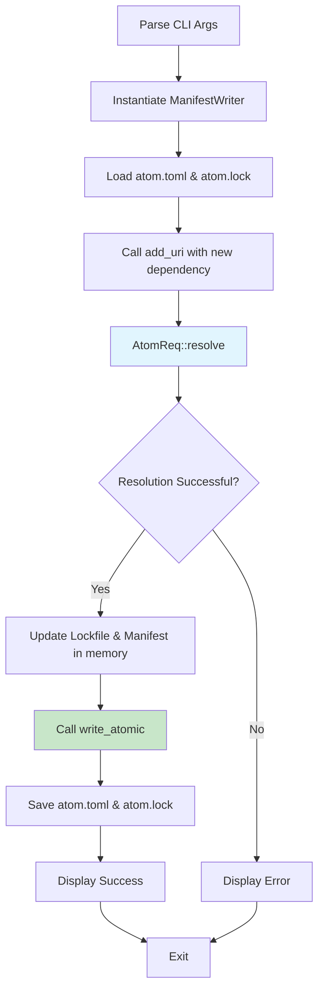

# Architectural Decision Record (ADR): Eka Add Command Architecture

## Status

Accepted

## Context

The `eka add` command adds `atom` dependencies to a project's manifest and updates the lockfile. It performs a full dependency resolution to ensure that the specified dependency exists and that all constraints are met before modifying `atom.toml` and `atom.lock`.

This ADR documents the final implementation, which focuses exclusively on resolving `atom` dependencies. The strategy for handling `pin` dependencies has been re-evaluated and will be addressed in a future ADR.

## Decision

The `add` command's functionality is orchestrated by the `ManifestWriter` struct, which manages atomic updates to both the manifest and the lockfile. The core logic resides in the `atom` crate, promoting separation of concerns between the CLI and the core library.

### 1. Manifest and Lockfile Management

The `ManifestWriter` (defined in `crates/atom/src/manifest/deps.rs`) is the central component for managing file I/O. It ensures that any changes to the `atom.toml` manifest and the `atom.lock` lockfile are written atomically, preventing corruption.

```rust
// in crates/atom/src/manifest/deps.rs
pub struct ManifestWriter {
    // ...
}

impl ManifestWriter {
    pub fn new(path: &Path) -> Result<Self, DocError>
    pub fn add_uri(&mut self, uri: Uri, key: Option<Name>) -> Result<(), DocError>
    pub fn write_atomic(&mut self) -> Result<(), DocError>
}
```

Error handling is localized within the modules where errors can occur, rather than being centralized in a single `error.rs` file.

### 2. Manifest and Lockfile Synchronization Strategy

A critical design goal of the `add` command is to guarantee that the `atom.toml` manifest and the `atom.lock` lockfile are always consistent. This is enforced by the `ManifestWriter` struct, which acts as a gatekeeper, ensuring that the files cannot be loaded or modified independently.

The synchronization process is initiated immediately upon the instantiation of `ManifestWriter::new`, before any modifications can be made. The algorithm is as follows:

1.  **Typed Loading**: The `atom.toml` manifest is loaded into a `TypedDocument<Manifest>`. This internal struct couples the raw TOML document (`toml_edit::DocumentMut`), which preserves formatting, with the strongly-typed `Manifest` struct. This ensures that the in-memory representation is always a valid reflection of the file's content.

2.  **Sanitization**: The `Lockfile::sanitize` method is called. Its purpose is to remove any stale entries from the lockfile that no longer correspond to a dependency in the manifest. This handles cases where a dependency has been manually removed from `atom.toml`.

3.  **Synchronization**: The `Lockfile::synchronize` method is then called to align the lockfile with the manifest's requirements. This involves two main checks:
    - **New Dependencies**: If a dependency exists in the manifest but not in the lockfile, it is resolved (`AtomReq::resolve`), and the resulting `AtomDep` is added to the lockfile.
    - **Out-of-Sync Dependencies**: If a dependency exists in both files, the system checks if the locked version in `atom.lock` still satisfies the version requirement in `atom.toml`. If it does not (e.g., the requirement was changed from `^1.0` to `^2.0`), the dependency is re-resolved, and the lockfile entry is updated with the new version.

This proactive synchronization on every load guarantees that the system always operates on a consistent state, preventing data drift and ensuring the reliability of the dependency resolution process.

### 3. Dependency Resolution and Locking

The `add` command's primary responsibility is to trigger a full dependency resolution and locking process. This is a significant departure from the original plan of a simple remote existence check.

**Execution Flow**:

1.  **Initialization**: The `ManifestWriter` is instantiated with the path to the project, loading the existing `atom.toml` and `atom.lock` files.
2.  **Add Dependency**: The `ManifestWriter::add_uri` method is called with the new dependency.
3.  **Resolution**: Inside `add_uri`, the `AtomReq::resolve` method (from `crates/atom/src/lock.rs`) is invoked. This function queries the remote Git repository (`store`) to find the highest matching version for the given `tag` and version requirement. A successful resolution confirms the atom's existence and provides the exact commit hash (`rev`) and atom ID.
4.  **Lockfile Update**: The resolved dependency, now an `AtomDep` struct, is added to the `Lockfile` instance managed by the `ManifestWriter`.
5.  **Manifest Update**: The new dependency is added to the `atom.toml` document.
6.  **Atomic Write**: The `ManifestWriter::write_atomic` method is called to save both the updated manifest and lockfile to disk.

This process ensures that a dependency is only added to the manifest if it can be successfully resolved and locked.

### 4. Data Structures

The implementation uses more detailed data structures than originally proposed to accurately model dependencies.

**Dependency Specification (`crates/atom/src/manifest/deps.rs`)**:

- `Dependency`: An enum that can represent different types of dependencies (`Atom`, `Pin`, `Src`).
- `AtomReq`: A struct representing a request for an atom dependency in the manifest. It includes:
  - `tag`: The optional, unique identifier of the atom.
  - `version`: The semantic version requirement.
  - `store`: The Git URL or local path of the atom's repository.

**Lockfile Structure (`crates/atom/src/lock.rs`)**:

The lockfile is fully implemented and is a critical part of the `add` command's operation.

- `Lockfile`: The root structure of the `atom.lock` file, containing a map of all resolved dependencies.
- `Dep`: An enum representing a locked dependency, which can be an `Atom`, `Pin`, etc.
- `AtomDep`: A struct representing a locked atom dependency. It contains the resolved information:
  - `tag`: The unique identifier of the atom.
  - `version`: The exact resolved `Version`.
  - `location`: The `AtomLocation` (URL or path).
  - `rev`: The resolved Git commit hash (`LockDigest`).
  - `id`: The cryptographic identity of the atom (`LockDigest`).

### 5. Pin Dependency Resolution

The implementation strategy for `pin` dependencies has been restructured and will be detailed in a future ADR. The focus of the current implementation is solely on `atom` dependency resolution.

## Consequences

**Pros**:

- **Correctness**: The system ensures that only resolvable dependencies are added to the manifest.
- **Atomicity**: The use of `ManifestWriter` prevents corruption by ensuring that the manifest and lockfile are always consistent.
- **Clear Separation of Concerns**: The core logic is contained within the `atom` crate, making it reusable and independent of the CLI.

**Cons**:

- **Increased Complexity**: The full resolution process is more complex than the originally proposed remote check, however it was always the intended end goal.

## References

- ADR 0001: Lock Generation in Eka CLI
- `gix` crate documentation: https://docs.rs/gix


