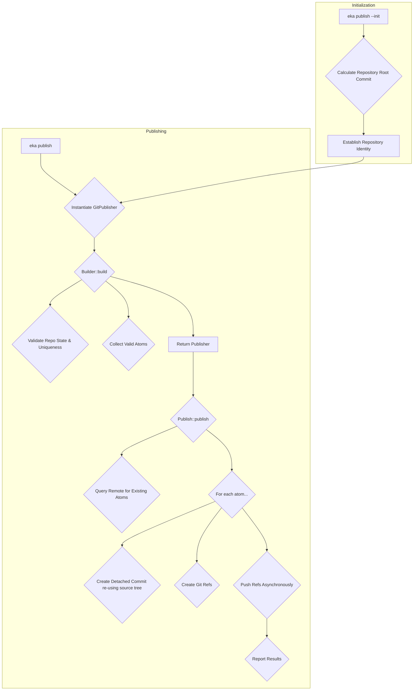

# Architectural Decision Record (ADR): Eka Publish Command Architecture

## Status

Accepted (Retroactive)

## Context

The `eka publish` command is a cornerstone of the atom ecosystem, providing a mechanism for publishing versioned, verifiable slices of a Git repository as atoms. This ADR retroactively documents the architecture of the `publish` command, which was implemented before the formal ADR process was established.

The primary goal of the `publish` command is to create a robust, in-source publishing strategy that leverages Git's object model for storage and transport, eliminating the need for a centralized registry. A key aspect of this is establishing a unique, verifiable identity for each repository of atoms.

## Decision

The `publish` command's architecture is designed around a clear separation of concerns, with a generic publishing framework defined in the `atom` crate and a specific implementation for Git. This is achieved through two primary traits: `Builder` and `Publish`. The initialization process, triggered by `eka publish --init`, is a critical prerequisite for all publishing operations.

### 1. Repository Initialization and Identity (`eka publish --init`)

Before any atoms can be published, the repository must be initialized to establish a unique, unambiguous identity. This identity serves as the "origin" for all atoms within the repository, ensuring that they are cryptographically distinct from atoms in any other repository.

- **Origin Calculation:** The repository's identity is derived from its root commit—the very first commit in its history. The hash of this root commit is used as a key to derive the BLAKE3 hash for every `AtomId` within that repository.
- **`Origin` Trait:** The `atom` crate defines an `Origin` trait, which is responsible for calculating this origin value. The `AtomId::construct` function uses this trait to create new atom IDs.
- **Source History Integrity:** By anchoring every atom's identity to the repository's root commit, the system guarantees that all atoms share a common, verifiable source history.

### 2. The `Builder` and `Publish` Traits

The core of the publishing system is defined in `crates/atom/src/publish/mod.rs`.

- **`Builder` Trait:** This trait is responsible for constructing and validating a `Publisher`. Its `build` method collects all valid atoms in the current workspace, ensuring that there are no duplicates and that the repository state is consistent before any publishing operations can occur. This design makes it impossible to create a `Publisher` for an invalid state.

- **`Publish` Trait:** This trait handles the actual publishing of atoms to a store. It exposes a `publish` method that iterates over a collection of atom paths and a `publish_atom` method for publishing a single atom. The trait is designed to be backend-agnostic, with the specific implementation handling the details of the target store.

### 3. The `GitPublisher`

The `GitPublisher` is the concrete implementation of the `Builder` and `Publish` traits for the Git backend.

**Key Responsibilities:**

- **State Validation:** The `GitPublisher`'s `build` method validates the Git repository's state, ensuring that the specified revision exists and that all atom manifests are well-formed.
- **Temporal Conflict Resolution:** To prevent ambiguity, the `publish` command enforces that no two atoms within the same commit (the same point in history) can share the same `package.label`. This ensures that every atom has a unique, calculable cryptographic ID.
- **Remote Atom Discovery:** Before publishing, the `GitPublisher` queries the remote repository for a list of existing atoms. This allows it to safely skip atoms that have already been published, preventing accidental overwrites and unnecessary network traffic.
- **Atom Commit Generation:** For each atom, the `GitPublisher` creates a new, detached commit. This commit points to the exact same tree object as the source commit, meaning there is no copying of actual source files (blobs) or trees. It is simply a new, lightweight reference to pre-existing Git objects. The commit message is augmented with metadata, and the timestamp is held constant to ensure that the commit hash is fully reproducible.
- **Git Reference Management:** The `GitPublisher` creates a set of Git references for each published atom, which serve as the public interface to the atom store.
- **Asynchronous Pushing:** To improve performance, the `GitPublisher` pushes the newly created atom refs to the remote asynchronously, allowing multiple pushes to occur in parallel.

### 4. Git Storage Example

The final reference structure in the Git remote serves as a queryable, decentralized index of all published atoms.

```console
❯ git ls-remote
From https://github.com/ekala-project/eka
ceebaca6d44c4cda555db3fbf687c0604c4818eb        refs/eka/atoms/ひらがな/0.1.0
a87bff5ae43894a158dadf40938c775cb5b62d4b        refs/eka/meta/ひらがな/0.1.0/manifest
9f17c8c816bd1de6f8aa9c037d1b529212ab2a02        refs/eka/meta/ひらがな/0.1.0/origin
```

- `refs/eka/atoms/...`: Points to the complete atom contents.
- `refs/eka/meta/.../manifest`: Points to a minimal tree containing only the atom's manifest.
- `refs/eka/meta/.../origin`: Points back to the original source commit for verification.

### 5. CLI Orchestration

The CLI component of the `publish` command is responsible for parsing arguments, instantiating and running the `GitPublisher`, and reporting the results to the user.

## Consequences

**Pros:**

- **Decentralized:** The git-native approach eliminates the need for a central registry.
- **Verifiable and Reproducible:** The use of a common root commit for identity and content-addressed commits ensures that atom publications are fully reproducible and cryptographically verifiable.
- **Efficient:** The re-use of existing Git tree objects, the ability to query remote refs, and asynchronous pushes make the publishing process highly efficient in terms of both storage and network traffic.
- **Extensible:** The `Builder` and `Publish` traits provide a clear path for supporting additional backends.

**Cons:**

- **Implementation Effort:** While the core architecture is extensible, adding support for new backends would require a significant implementation effort.

## References

- `crates/atom/src/id/mod.rs`
- `crates/atom/src/publish/mod.rs`
- `src/cli/commands/publish/mod.rs`


