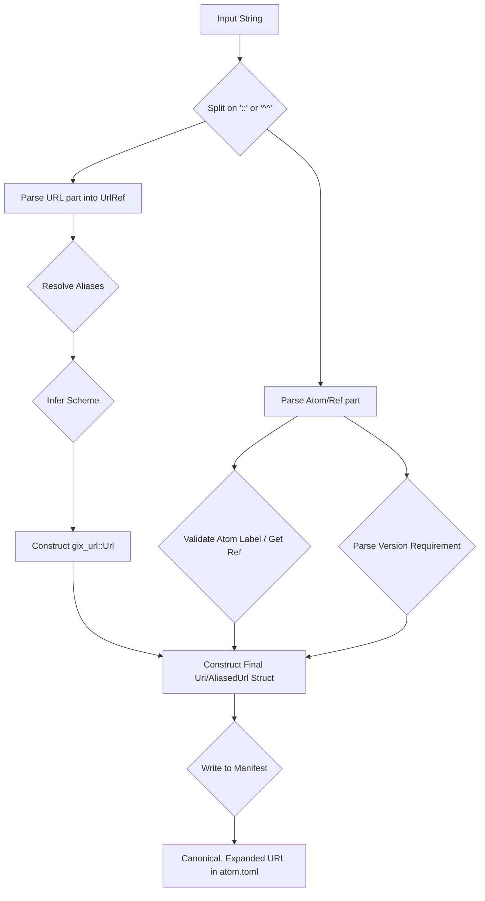

# Architectural Decision Record (ADR): Atom URI Format

## Status

Accepted (Retroactive)

## Context

A robust and user-friendly addressing scheme is essential for a decentralized dependency management system like Eka. This ADR retroactively documents the design and implementation of the Atom URI format, which was created before the formal ADR process was established.

The primary goals of the URI format are:

- To provide a single, consistent format for referencing atoms and other dependencies from various sources.
- To be intuitive and easy for users to read and write.
- To support URL shortening and aliasing for convenience, dramatically simplifying workflows.
- To ensure that all dependency information is fully resolved and unambiguous when written to the manifest.

## Decision

The Atom URI format is a custom scheme designed to be both powerful and ergonomic. It is parsed by a combination of manual string splitting and the `nom` parser combinator library, providing a balance of performance and flexibility.

### 1. URI Structure

The abstract syntax for an Atom URI is as follows:

```
[scheme://][[user[:pass]@][url-alias:][url-fragment::]label[@version]
```

**Component Breakdown:**

- **`scheme` (Optional):** The protocol to use (e.g., `https`, `ssh`, `file`). If omitted, the scheme is inferred based on the other components.
- **`user[:pass]` (Optional):** User credentials for authentication.
- **`url-alias` (Optional):** A user-configurable alias that expands to a full URL.
- **`url-fragment` (Optional):** The path to the repository or a URL fragment that is combined with an alias.
- **`label` (Required):** The unique, human-readable identifier for the atom.
- **`version` (Optional):** A semantic version requirement for the atom.

### 2. Aliased URLs for Pinned Dependencies

To extend the convenience of aliases to non-atom dependencies (e.g., pinning a Git repository to a specific branch), the URI module also supports an "aliased URL" format. This format uses the `^^` delimiter to separate the URL from a Git ref.

**Syntax:** `[aliased-url]^^[git-ref]`

**Example:** `gh:my-org/my-repo^^my-branch`

### 3. Parsing Strategy

The URI parsing logic in `crates/atom/src/uri/mod.rs` is implemented in several stages:

1.  **Initial Split:** The input string is first split on the `::` (for atoms) or `^^` (for aliased URLs) delimiters.
2.  **URL Parsing (`UrlRef`):** The URL part is parsed into a `UrlRef` struct, which captures the scheme, user, password, and URL fragment as string slices.
3.  **Alias Resolution:** The `UrlRef`'s `to_url` method resolves any aliases. The alias map is a combination of hard-coded defaults (`gh` -> `github.com`, `gl` -> `gitlab.com`) and user-defined aliases from `eka.toml`.
4.  **Scheme Inference:** If no scheme is explicitly provided, it is inferred based on the following heuristics:
    - If a user is present without a password, or if the URL contains a `:` after the domain (e.g., `git@github.com:user/repo`), it defaults to `ssh`.
    - If a hostname is present, it defaults to `https`.
    - Otherwise, it defaults to `file`.
5.  **Final Construction:** The parsed and resolved components are used to construct a final `Uri` or `AliasedUrl` struct.

### 4. UI-Only Aliases

A critical design decision is that aliases are a **user interface-only concern**. When a user adds a dependency using an aliased URI, the alias is immediately expanded to its full, canonical URL before being written to the `atom.toml` manifest.

This approach ensures that the manifest is always self-contained and portable. If aliases were written directly to the manifest, a user-defined alias on one machine would cause a resolution failure on another machine where that alias is not defined.

## Consequences

**Pros:**

- **User-Friendly:** The URI format is concise and easy to read, and the alias system dramatically simplifies working with frequently used repositories.
- **Flexible:** The format can represent both atom and non-atom dependencies from a variety of sources.
- **Portable Manifests:** By resolving aliases before writing to the manifest, the system guarantees that projects are portable and reproducible across different environments.

**Cons:**

- **Complexity:** While the parsing logic for scheme inference and alias resolution is complex, it is backed by an extensive test suite to prevent regressions.
- **Custom Scheme:** As a custom URI scheme, it requires dedicated tooling and documentation.

## References

- `crates/atom/src/uri/mod.rs`


